  

  

  
  
  
  

<h2>Sobre mim</h2>

<table>
  <tr>
    <td width="60%" valign="top">
      <ul>
        <li><b>FullStack Web Developer</b> &mdash; do front-end ao back-end, do zero ao deploy</li>
        <li><b>Java Developer</b> &mdash; sistemas robustos e escaláveis</li>
        <li>Criador de <b>bots para Discord</b> e sistemas para comunidades</li>
        <li><b>CEO</b> &mdash; empreendedor no Brasil e no Reino Unido</li>
      </ul>
      Passe o mouse sobre os ícones e empresas para ver mais detalhes.
    </td>
    <td width="40%" align="center" valign="middle">
      
    </td>
  </tr>
</table>

<h2>Empresas</h2>

  
  
  
   
  
  
  

<h2>Tecnologias</h2>

  
  
  
  
  
  
  
  
  
   
  
  
  
  
  
  
  
  
  

 

  

   
  
    
  
   
  Você chegou até aqui. Agora termine o que começou.

<h2>Contato</h2>

  Aberto a parcerias, projetos sob medida e oportunidades de negócio. 
  <b>Discord:</b> <a href="https://discord.com/users/308243917957103616" title="Fale comigo no Discord">meu perfil</a> &middot; <a href="https://discord.gg/cidadenext" title="Entrar no servidor">servidor Cidade NEXT</a> 
  <b>Instagram:</b> <a href="https://www.instagram.com/cidadenext/" title="Cidade NEXT">Cidade NEXT</a> &middot; <a href="https://www.instagram.com/martinsconfort/" title="Martins Confort">Martins Confort</a> &middot; <a href="https://www.instagram.com/atacadaodomartins/" title="Atacadão do Martins">Atacadão</a> 
  <b>X:</b> <a href="https://x.com/Kaiooou" title="Siga no X">@Kaiooou</a> 
  <b>E-mail:</b> <a href="mailto:kaiomartins.uk@gmail.com" title="Enviar e-mail">kaiomartins.uk@gmail.com</a>

  

